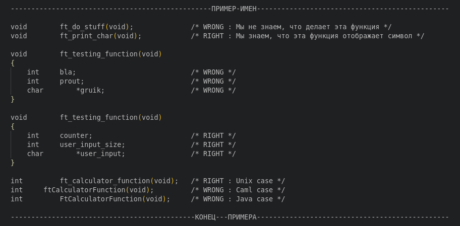
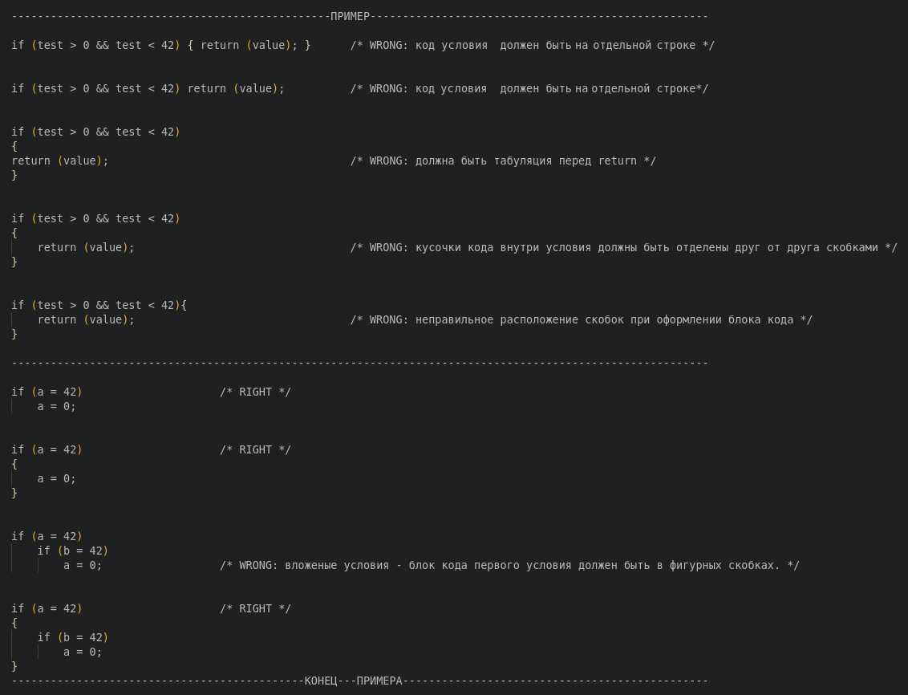
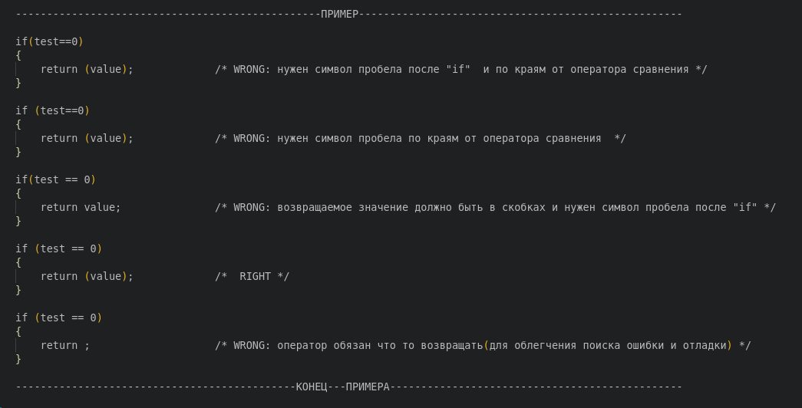
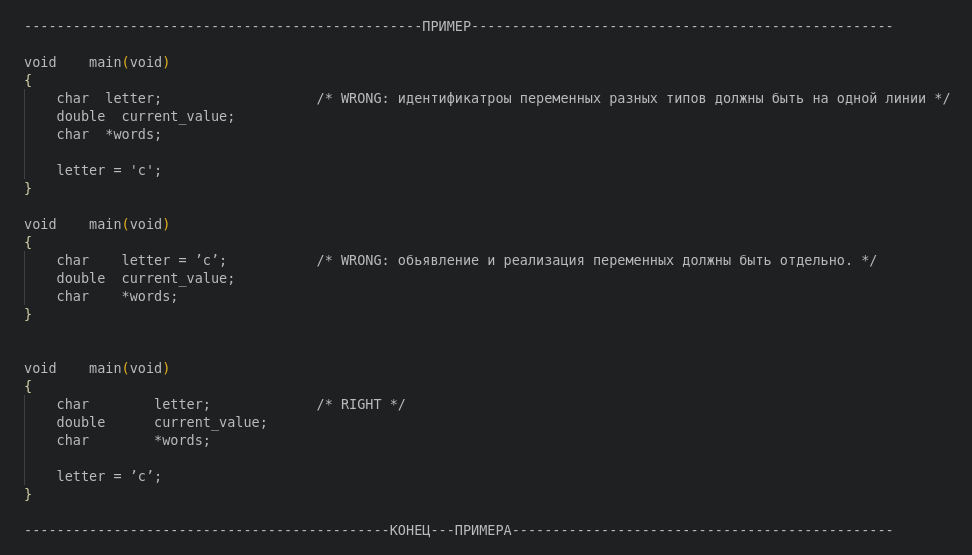
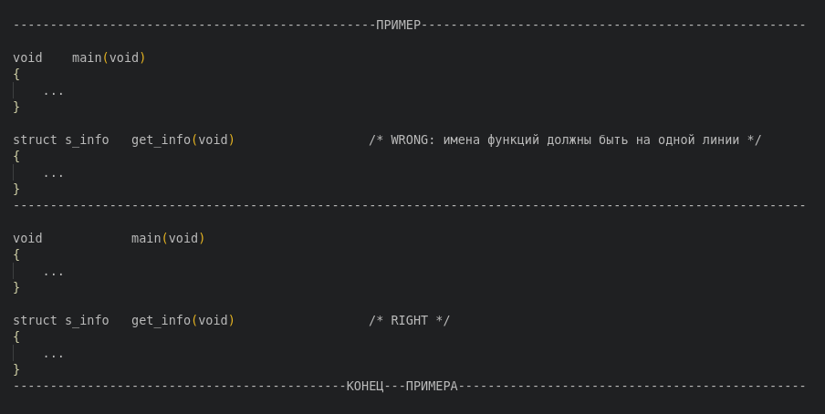

# Стандарт 42

## Версия 1.8

Benny benny@42.fr

Thor thor@42.fr

marvin marvin@42.fr

Резюме: в этом документе описан действующий стандарт С на 42. Стандарт
программирование определяет набор правил, регулирующих написание кода. Он
Обязательно соблюдать стандарт при написании от C до 42.

## Содержание ## 

I       Предисловие

I.1    Зачем навязывать стандарт?
I.2    Стандарт в ваших визуализациях
I.3    Советы.

II.1   Норма 42

II.1    Соглашение об именах.
II.2    Форматирование
II.3    Параметры функции.
II.4    Функции
II.5    Typedef, struct, enum и union
II.6    Заголовки. 
II.7    Макросы и препроцессор. 
II.8    Запрещенные вещи! 
II.9    Комментарии.
II.10   Файлы.
II.11   Makefile. 

III.      Норминетта(La Norminette)

## Глава I ## 

### Предисловие ### 

В этом документе описывается действующий стандарт С на 42. Стандарт программирования
определяет набор правил, регулирующих написание кода. Обязательно соблюдать стандарт при
написании от С до 42.

### I.1 Зачем навязывать норму ? ###

Стандарт имеет две основные цели:
* Стандартизируйте свои коды, чтобы каждый мог легко их прочитать, студенты и кон-
тролеры.
* Пишите простые и понятные коды.

### I.2 Стандарт в ваших рендерингах ###

* Все ваши файлы кода C должны соответствовать стандарту 42. Стандарт будет проверен
вашими корректорами и малейшая стандартная ошибка даст оценку 0 для вашего проекта или к
вашему упражнению.

* Корректирующая утилита, используемая в дополнение к вашей защите задания, запустит
программу под названием `Norminette`. Norminette проверит подмножество стандартных правил,
которые он может проверить.

* При правильном исправления, вы должны проверять только стандартные правила, которые
Norminette может проверить в своей текущей версии. Таким образом, все будут равны перед
лицом стандарта. Вы найдете список стандартных правил, которыми Norminette управляет в
данный момент в конце этого документа. Этот список будет регулярно обновляться в банке,
так что следите за этим.

### I.3 Cовет ###

* Как вы быстро поймете, норма - это не ограничение. А наоборот, стандарт-это предо-
хранитель, чтобы направлять вас в написании простого и базового Си. Вот почему абсолютно
важно, чтобы вы напрямую кодировали стандарт, пусть и кодируя медленнее в первые часы.
Исходный файл, без стандарта так же плох, как файл, который насчитывает десять. Будьте
прилежны и стандарт скоро станет автоматизмом.

## Глава II ##

### Стандарт 42 ###
### II.1 Соглашение об именах. ###

Обязательная часть:

* Название структуры(struct) должно начинаться с `s_`.
* Название типа даных(typedef) должно начинаться с `t_`.
* Название обьединения(union) должно начинаться с `u_`.
* Название перечисляемого типа данных(enum) должно начинаться с `e_`.
* Глобальное имя должно начинаться с `g_`.
* Имена переменных, имена функций должны состоять исключительно из строчных букв,
цифр и «_» (Unix Case).
* Имена файлов и каталогов должны состоять исключительно из строчных букв, цифр
и `_` (Unix Case).
* Части составных имен будут разделены символом «_» (подчеркивание).

Рекомендуемая часть:

* Синтаксические объекты (переменные, функции, макросы, типы, файлы или каталоги)
должны иметь наиболее явные или мнемоновые имена. Только `счетчики` могут быть 
названы по вашему желанию.
* Сокращения допускаются, поскольку они позволяют значительно уменьшить размер имени
без потери его значения.
* Все идентификаторы (функции, макросы, типы, переменные и т.д.) должны быть на
английском языке. Ни французского, ни `английского`.
* Любое использование глобальной переменной должно быть оправдано.

### II.2 Форматирование ###

* Все ваши файлы должны начинаться со стандартного заголовка 42 с первой строки. 

* Каждая функция должна содержать не более 25 строк без учета фигурных скобок в функциональном блоке.

Пример пятистрочной функции:

* Вы должны сделать отступ в своем коде используя табуляцию из 4 пробелов (это не эквивалентно 4 пробелам,
это действительно должна быть табуляция). В своей базовой конфигурации ваш редактор может вставлять 
пробелы вместо табуляции, будьте осторожны. Обратитесь к документации вашего издателя, если сомневаетесь.
* Каждая строка не может содержать более 80 столбцов, включая комментарии. (Внимание, табуляция учитывается
не для столбца, а для n пробелов, которые она представляет).

> Внимание: табуляция учитывается не для столбца, а для n пробелов, которые он
представляет

* Только одно объявление на строку.
* Только одна инструкция на строку.
* Пустая строка не должна содержать пробелов или табуляции.
* Строка никогда не должна заканчиваться пробелами или символами табуляции.
* Открывающая или закрывающая скобка должна быть одна на своей линии с правильной идентификацией. Особый
случай - struct / union / enum / typedef. Они обсуждается ниже.
* Вы должны вернуться к строке в конце структуры управления (if, while и т. д.).
* Вы должны поставить фигурные скобки после структуры управления, если блок имеет более одного оператора.

* За каждой запятой или точкой с запятой должен следовать пробел, если мы не находимся в конце строки.
* Каждый оператор (двоичный или троичный) и его операнды должны быть разделены пробелом и только одним. 
Однако между унарным оператором и его операндом не должно быть пробела.
* За каждым ключевым словом в Cи должен следовать пробел, за исключением спецификаторов типа (таких
как int, char, float, const и т.д.), А также sizeof.
* Выражение, возвращаемое с ключевым словом `return`, должно быть заключено в круглые скобки.

* Каждое объявление переменной должно иметь отступ в одном и том же столбце.Звезды указателей должны быть 
приклеены к имени переменной и друг к другу.
* тип переменной и ее идентификатор должны быть разделены хотя бы одной табуляцией.
* Только одно объявление переменной на строку.
* Нельзя делать объявление и инициализацию в одной строке, за исключением глобальных переменных, стати-
ческих переменных, констант и инициализации массивов. В частности, в последнем случае, выражение инициа-
лизации массива должно быть стандартным (фигурные скобки, запятые, ...).

* Объявления должны находиться в начале блока и должны быть отделены от реализации пустой строкой.
* В середине объявлений или реализации не должно быть пустых строк.

* Вы можете вернуться к строке во время той же инструкции или структуры управления, но вы должны добавить
отступ по скобкам или оператору присваивания. Операторы должны быть в начале строки. Перенос строки влияет на
читабельность вашего кода, так что будьте измерены. В более общем случае, если у вас слишком длинные инструкции
или выражения, это потому, что вы недостаточно учли свой код.

### II.3 Параметры Функций ###

* Функция принимает не более 4 именованных параметра.
* Функция, которая не принимает аргументов, должна быть явно прототипирована со словом void в качестве
аргумента.

### II.4  Функций ###

* Параметры прототипа функции должны иметь имена.
* Вы можете объявить не более 5 переменных на блок.
* Ваши идентификаторы функции должны быть выровнены в одном файле (относится к заголовкам).
* Каждое определение функции должно быть отделено пустой строкой.
* Возвращаемый тип функции и идентификатор этой функции должны быть разделены по крайней мере одной
табуляцией

* Помните, что мы всегда ставим пробел после запятой или точки с запятой, если мы не находимся в конце
строки.

II.5	Определение типа struct, enum или union(структуры, перечисления или объединения)

* Анонимные структуры, объединения и списки запрещены.
* Объявления struct, enum или union должны находиться в глобальной области.
* Вам необходимо поместить табуляцию перед идентификатором при объявлении
структуры, перечислении или объединении.

* При объявлении переменной типа struct, enum или union вы помещаете в тип только пробел.

* Вы должны использовать табуляцию между двумя параметрами typedef.

-------------------------------------------------ПРИМЕР----------------------------------------------------

typedef int	myint;					/* WRONG: тут между двумя типами должно быть две табуляции а не одна. */
typedef	int	myint;					/* RIGHT */

---------------------------------------------КОНЕЦ---ПРИМЕРА-----------------------------------------------

* Когда вы объявляете struct, enum или union с помощью typedef, применяются все правила, и вы должны
сопоставить имя typedef с именем структуры, объединения или перечисления.
* В этом конкретном случае имя typedef может находиться в одной строке с закрывающей фигурной скобкой.

-------------------------------------------------ПРИМЕР----------------------------------------------------

typedef	struct	s_buff
{
	    ....							/* WRONG: имя создаваемой структуры и имя с которым мы его будем ассоциировать(новый тип) должны быть на одной линии */
}	    t_buff;

typedef	struct	s_buff
{
	    ....							/* WRONG: имя создаваемой структуры и имя с которым мы его будем ассоциировать(новый тип) должны быть на одной линии */
}t_buff;

typedef	struct	s_buff
{
	    ....							/* WRONG: имя создаваемой структуры и имя с которым мы его будем ассоциировать(новый тип) должны быть на одной линии */
}	t_buff;

typedef	struct	s_buff
{
	    ....							/* RIGHT */
}				t_buff;

---------------------------------------------КОНЕЦ---ПРИМЕРА-----------------------------------------------

II.6	Заголовки

* В заголовочные файлы допускаются только включения заголовков (системные или нет), определения структур данных, определения, прототипы и макросы.
* Любое включение заголовка должно быть оправдано как в .c, так и в .h.
* Все включения .h должны быть сделаны в начале файла (.c или .h).
* Стандарт также применяется к заголовкам.
* Заголовки должны быть защищены от двойного включения. Если файл foo.h, контрольный макрос - FOO_H.

-------------------------------------------------ПРИМЕР----------------------------------------------------
#ifndef FOO_H
# define FOO_H

/* code header */

#endif /* !FOO_H */
---------------------------------------------КОНЕЦ---ПРИМЕРА-----------------------------------------------

* В уникальном и конкретном случае строки комментария справа от #endif, cтандарт комментариев не применяется (см. ниже в этом документе).
* Включение заголовка (.h), который не используется, запрещен.
* Макросы должны находиться исключительно в файлах .h. В файлах .c допускаются только те макросы, которые активируют функциональные возможности (например, BSD_SOURCE).

II.7 Макросы и препроцессор

* Многострочные макросы запрещены.

* Только имена макросов пишутся с большой буквы.

-------------------------------------------------ПРИМЕР----------------------------------------------------
#define FOO `bar`
---------------------------------------------КОНЕЦ---ПРИМЕРА-----------------------------------------------

* Символы, следующие за #if, #ifdef или #ifndef, должны отступать с пробелом на каждом уровне.

-------------------------------------------------ПРИМЕР----------------------------------------------------
#ifndef TOTO_H
# define TOTO_H
# ifdef __WIN32
#  define FOO `bar`
# endif /* __WIN32 */
#endif /* !TOTO_H */
---------------------------------------------КОНЕЦ---ПРИМЕРА-----------------------------------------------

* Нет #if, #ifdef или #ifndef после первого определения функции в .c

II.8 Запрещенные вещи!

Вам не разрешено использовать:

* for

* do . . .while

* switch

* case

* goto

* Тернарные операторы

-------------------------------------------------ПРИМЕР----------------------------------------------------

(a ? (b ? : -1 : 0) : 1)				/* WRONG */

---------------------------------------------КОНЕЦ---ПРИМЕРА-----------------------------------------------

* Тернарные операторы, используемые для чего-либо, кроме назначения.

-------------------------------------------------ПРИМЕР----------------------------------------------------

(a == 42 ? fun1() : fun2());			/* WRONG */
a = (a == 42 ? fun1() : fun2());		/* RIGHT */

---------------------------------------------КОНЕЦ---ПРИМЕРА-----------------------------------------------

II.9 Комментарии

* Комментарии можно найти во всех исходных файлах.

* В теле функций не должно быть комментариев.

* Комментарии начинаются и заканчиваются на одной строке. Все промежуточные линии выстраиваются по ним и начинаются с`**`.

* Нет комментариев C++ (`//`).

* Ваши комментарии должны быть на английском языке и полезны.

* Комментарий не может оправдать искаженную функцию.

-------------------------------------------------ПРИМЕР----------------------------------------------------
/*
** This function makes people laugh
*/
void	ft_lol(void)
{
}

/*
** Right
*/
/*
 * Wrong
*/
*********************************************КОНЕЦ***ПРИМЕРА***********************************************

II.10	Файлы

* Вы не можете включить .c. Никогда. Даже если кто-то сказал вам сделать это.

* Вы не можете иметь более 5 определений функций в .c

II.11	Makefile

* Правила $(NAME), clean, fclean, re и all являются обязательными.

* Проект считается нефункциональным, если make-файл перелинкован (перекомпонован).

* В случае мультибинарного проекта, в дополнение к предыдущим правилам, у вас должно быть правило all, компилирующее все двоичные файлы, а также правило, специфичное для каждого скомпилированного двоичного файла.

* В случае проекта, использующего библиотеку функций (например, libft), ваш Makefile должен автоматически скомпилировать эту библиотеку.

* Использование подстановочного знака (например, * .c) запрещено.

Глава III

Norminette

В своей текущей версии Norminette проверяет правила в этом разделе.
Мы будем регулярно обновлять этот раздел. Конечно, должны соблюдаться все стандартные правила, в том числе те, которые Norminette еще не проверяет, и те, которые не подлежат автоматической проверке, но вы должны проверять только следующие правила во время взаимного исправления. Обратитесь к предыдущим разделам для деталей каждого правила.

* Все ваши файлы должны начинаться со стандартного заголовка 42 с первой строки.

* Каждая функция должна содержать не более 25 строк без учета фигурных скобок в функциональном блоке.

* Каждая строка не может содержать более 80 столбцов, включая комментарии. (Обратите внимание, что табуляция считается не за 1 столбец, а за n пробелов, которые она представляет).

* Только одна инструкция на строку.

* Пустая строка не должна содержать пробелов или табуляции.

* Строка никогда не должна заканчиваться пробелами или символами табуляции.

* Когда у вас есть конец структуры управления, вы должны вернуться к строке.

* Вы должны поставить пробел после ключевого слова.

* Вы должны ставить пробел после запятой или точки с запятой, если это не конец строки.

* Вы должны поставить пробел до и после двоичного или троичного оператора.

* Вы не имеете права использовать : for, do . . .while, switch, case и goto.

* Комментарии C++ (`//`) запрещены.

* Вы можете сделать только 5 определений функций на файл.

* Функция может принимать только 4 параметра.

